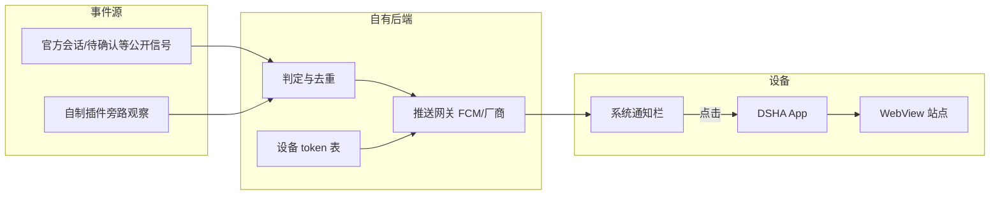

# 离线推送设计草案（杀进程仍可达）

日期：2026-10-09（按用户澄清修订）。**仅设计，未授权实施。**  
承接讨论：现有 HanApp `showNotification` 不是离线投递；目标为「App 划掉后仍能收到」。

相关契约：[SECURITY.md](../SECURITY.md)（当前「非离线推送」）、[THREE-MODULE-INTEGRATION.md](../THREE-MODULE-INTEGRATION.md)、[COMPATIBILITY.md](../COMPATIBILITY.md)（明确不支持离线推送——本草案若落地需修订该条）、[DEPLOYMENT.md](../DEPLOYMENT.md)。

---

## 0. 已确认的现场问题（2026-10-09）

| 事实 | 含义 |
|---|---|
| 定时任务在**服务器**上跑完 | Host 活着时业务已发生；不是「手机网页没开就不跑」 |
| 服务器侧**已有通知/结果**（会话里能看到） | 缺口不在「有没有事发生」，而在**投递到锁屏/通知栏** |
| 用户离线（App 未开 / 已杀） | 现在只能**下次打开 App** 在会话里看到 |
| 期望 | **当时就能在手机上看到**（类微信），点开再进站看详情 |

官方 Schedule 的设计边界（公开文档）：提醒投递进**原会话**；**不提供**邮件 / 短信 / 外部推送通道。社区常见做法是 Host 插件旁路（如 `dsh-notify` → Telegram/Bark/ntfy）。DSHA 若要「类微信进系统通知栏」，需要**自己接厂商/FCM 推送**，或先接现成外发通道再演进到 App 内推送。

---

## 1. 产品句（建议）

| 场景 | 行为 |
|---|---|
| App 进程存活且页面后台 | 可继续用现有桥本地通知（补充通道） |
| App 进程不在 / 冷启动后 | **服务端已有的「该告诉用户」事件 → 系统推送通道送达** |
| 手机无网 | 不可达；有网后由通道补投或下次打开再看会话（与微信类似：无网时也推不到） |

一句话：**服务器已经写好了通知；缺的是「推到这台手机的系统通知栏」。网页桥解决不了。**

---

## 2. 产品范围（按澄清更新的默认）

| 项 | 默认 | 说明 |
|---|---|---|
| 推什么 | **P0：定时任务 / Agent 已在服务器产生、应对用户可见的结果**（含 schedule 投递、回合完成、待确认等——以现网能钩到的事件为准） | 对齐「服务器上有通知但手机看不到」 |
| 仍保留 | 进程内 hanui 待确认桥通知 | 作补充，不宣称离线 |
| 正文内容 | 短标题 + 可选一句摘要；默认**不推全文** | 点开进会话看详情；摘要策略可配置 |
| 点开落地 | 精确 origin 内 URL（尽量落到相关会话） | 与现有 notification 意图同类校验 |
| 谁可收 | 当前 **hanaccount 已认证** 绑定的设备 | 退出 / 吊销 → 停推 |
| 设备数 | 每账号有界（建议 ≤5） | — |
| 地域 / 通道（个人自用默认） | **不接厂商账号、不接 FCM**；Host 旁路外发到 **ntfy / Bark / Telegram / 通用 webhook** 等 | 见 §5.0；产品级「进 DSHA 通知栏」后置 |
| 不做（个人阶段） | 小米/华为推送 SDK、Firebase 工程、保活假离线、改官方 DSH 核心 | — |

---

## 3. 架构分层



### 责任归属（延续「每事实一个所有者」）

| 事实 | 所有者 | 禁止 |
|---|---|---|
| 是否该推、推哪类 | **自有推送服务**（新模块，建议挂在 `<SITE_HOST>` 旁路，经 hanaccount 鉴权） | App / hanui 在杀进程后「猜」 |
| 设备 push token | App 注册 → 服务端存 | 网页任意读 token |
| 通知文案与敏感度策略 | 服务端策略 + 产品默认 | 推送体携带消息全文（默认） |
| 点开后导航 | App `NavigationPolicy` + 现有 notification 意图模型 | 打开任意外部 URL |
| 进程内本地提示 | hanui + HanApp 桥（现状） | 宣称等于离线推送 |

不把推送做成「又一个与业务同级的 Harness 官方插件」当唯一通道；**鉴权复用 hanaccount**，投递走系统推送。

---

## 4. 事件源策略（最大风险点）

杀进程后网页观察者（`pendingInteractions` + `visibilityState === 'hidden'`）**不存在**。必须在服务器侧有等价信号。

### 4.1 候选

| 来源 | 可行性 | 备注 |
|---|---|---|
| **A. 服务端旁路订阅官方/网关已有事件**（Host 侧或你们已部署的 session 相关服务） | 需调研现网能否在**不改官方包字节**下挂观察者 | 最贴「待确认 / 回合结束」 |
| **B. 自制插件在服务端进程内钩公开总线**（类似 session-cache Host 挂点） | 与现有三插件模式一致 | 事件形状必须稳定、可测试 |
| **C. 仅客户端上报「我看见待确认」再由服务器转推** | **不能**满足杀进程 | 只适合进程存活时的去重/补充 |
| **D. 轮询官方 HTTP API** | 若有稳定、已鉴权、低敏的只读端点 | 延迟与配额需控；易变成伪实时 |

**第一期建议**：优先 **B（或 A+B）**——在你们已控制的 Host/插件进程里产生「推送意图」事件；App 不解析 DSH DTO，只收服务端已裁好的 `PushIntent`。

### 4.2 推送意图（逻辑形状，非最终 API）

```text
PushIntent {
  accountKey      // 与 hanaccount 会话/设备绑定键，非密码
  kind            // needs_action | reply_ready | ...
  dedupeKey       // 同事项不刷屏
  title, body     // 短、无全文
  targetPath      // 站内 path 或入口
  expiresAt       // 过期不推
}
```

去重：同一 `dedupeKey` 在冷却窗内只推一次；用户点开或事项消失可取消（若通道支持）或依赖 autoCancel。

---

## 5. 推送通道

### 5.0 个人自用首选（已拍板方向：简单、无厂商账号）

在 **Host 进程**里旁路订阅「该告诉用户」的事件，用 HTTP 发到现成通道。手机装对应客户端即可；**不必**改 DSHA App、不必注册小米/华为/Firebase。

| 通道 | 复杂度 | 备注 |
|---|---|---|
| **ntfy** | 低 | 安卓有官方 App；可用公共 `ntfy.sh` 或自建；服务器 `POST` 一个 topic 即可 |
| **Bark** | 低 | 偏 iOS；安卓可用性看社区客户端 |
| **Telegram Bot** | 低 | 一个 bot token + chat id |
| **飞书/钉钉 webhook** | 低 | 若你已在用 |
| 通用 webhook | 低 | 自己接任意接收端 |

社区已有同类插件模式（如 `dsh-notify`：schedule 镜像 + `notify_send`）。个人阶段优先 **复用/部署这类 Host 插件**，而不是自研 App 内推送。

验收：定时任务在服务器完成后，**手机通知栏（ntfy 等）弹出**；打开 DSHA 仍可在会话里看全文。

### 5.1 以后若要「进 DSHA 自己的通知栏」

再考虑 FCM / 厂商 SDK（需开发者账号）。与个人自用阶段分离，不阻塞 §5.0。

### 5.2 明确拒绝（个人阶段）

- 为个人使用去注册小米/华为推送、Firebase
- 仅靠 `WorkManager` / 保活 WebView 冒充离线推送

---

## 6. App / 协议面（薄壳）

### 6.1 新增能力（概念）

| 能力 | 说明 |
|---|---|
| 注册 / 刷新 / 注销 push token | 需已登录（hanaccount 会话有效）；绑定 `resumeScope` 或服务端颁发的 device 绑定票据 |
| 展示系统通知 | 可与现渠道 `website` 分立为 `push` 渠道，避免与网页桥互相 `cancelAll` 误伤 |
| 点击打开 | 复用 / 扩展 `OPEN_WEBSITE_NOTIFICATION` 一类意图；校验 owner + token + 同 origin |

### 6.2 与现桥的关系

- `showNotification`：**保留**为进程内通道
- `capabilities`：可增加 `offlinePush: boolean`（设备是否已注册且服务端确认）
- 网页**不得**直接拿到 FCM 原始 token 发给任意第三方

### 6.3 权限与 UX

- 仍要系统 `POST_NOTIFICATIONS`（K80 上曾未授予 → 任何通道都看不见）
- 设置里提供「开启离线通知」：申请权限 → 注册 token → 显示绑定状态
- 退出登录 / 清除本地登录：注销 token + 服务端吊销

### 6.4 安全

- 推送体默认无会话正文、无 Cookie、无密码
- 点击 URL 必须过 `NavigationPolicy`
- 服务端注册接口：仅持有效 gate/native 会话（或短期 device grant）可写 token
- 换站：按 origin/站点维度隔离设备绑定，防串站

---

## 7. 分阶段交付（建议）

| 阶段 | 交付 | Done 信号 |
|---|---|---|
| **P0 调研** | 现网能否在不改官方核心下拿到「待确认 / 回合结束」服务端信号；输出事件源结论（可行 / 缺口） | 书面结论 + 样例事件 |
| **P1 管道** | 设备注册 API + FCM 发一条测试推送到已装 App（人工触发即可） | 杀进程后仍弹出测试通知 |
| **P2 业务接线** | needs-action → PushIntent → 真机；点开进站 | 与现「后台待确认」语义对齐的一次端到端 |
| **P3 加固** | 去重、退出吊销、多设备上限、渠道分离、文档修订 COMPATIBILITY/SECURITY | 回归清单全绿 |
| **P4 可选** | reply_ready；国内厂商通道 | 单独里程碑 |

不与 phase3 冷启抢主线时：P0 可并行调研；P1+ 单独立项。

---

## 8. 开放问题（个人路径下）

已拍板：个人自用、**无厂商/FCM 账号** → §5.0 外发。

仍待定：

1. **首选通道**：ntfy（安卓友好）还是 Telegram / 其它？  
2. **部署方式**：现成社区插件（如 `dsh-notify`）装到现网 Host，还是自写极简旁路？  
3. **事件范围**：是否第一期只镜像 **schedule 投递**，还是加上回合完成 / 待确认？  
4. **优先级**：相对 phase3 / HyperOS 排第几？

---

## 9. 非目标（本草案）

- 无网时收到服务器上新发生的事件  
- 用保活 / 假页面实现「离线」  
- 个人阶段做厂商推送 / 改 DSHA App 接 SDK  
- 改官方 Schedule「只投递进会话」的核心行为（只旁路镜像）  

---

## 10. 下一步（仍不写代码，除非你授权）

1. 你选定通道（建议 **ntfy**）。  
2. 在现网 Host 上评估：直接装社区 notify 插件 vs 自写 webhook 旁路。  
3. 装好后做一次：定时任务完成 → 手机（App 杀掉）仍弹出。
